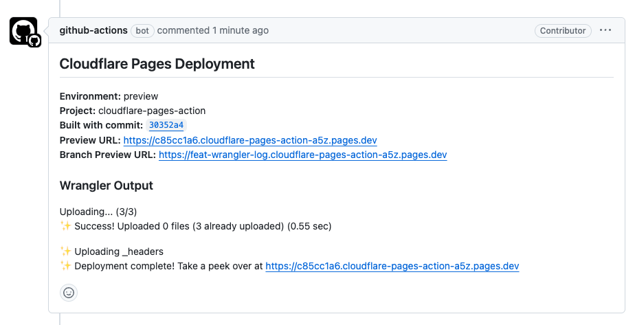

[](https://github.com/unlike-ltd/github-actions-cloudflare-pages/actions/workflows/test.yml) [](https://github.com/unlike-ltd/github-actions-cloudflare-pages/actions/workflows/check-dist.yml) [](https://github.com/unlike-ltd/github-actions-cloudflare-pages/actions/workflows/release.yml) [](https://results.pre-commit.ci/latest/github/unlike-ltd/github-actions-cloudflare-pages/main)

# GitHub Action Cloudflare Pages

This action deploys your build output to [Cloudflare Pages] using [Wrangler]. [GitHub Environments] and [GitHub Deployment] are used to keep track of the [Cloudflare Pages] deployments.

When used in context of a [pull request], the action will create a deployment for the pull request and add a comment with the URL of the deployment.

- Deploy to [Cloudflare Pages].
- Use [GitHub Environments] & [GitHub Deployment].
- Comment on pull requests with deployment URL.
- Delete deployments using [`unlike-ltd/github-actions-cloudflare-pages/delete`](./delete/README.md)
- Define a `working-directory` input for the `wrangler` cli command to execute from. Useful for monorepos where the `functions` folder may not be in the root directory.

## GitHub Environments - **(Required)**

> **This GitHub Action doesn't create the required [GitHub Environments], see below for more information.**

The GitHub Action uses [GitHub Environments] for the deployments. **This GitHub Action doesn't create [GitHub Environments]**, this is due to the required permission of `administration:write` by the GitHub API, you will have to do this manually, see [Creating an environment](https://docs.github.com/en/actions/deployment/targeting-different-environments/using-environments-for-deployment#creating-an-environment).

For example manually create two GitHub Environments called "production" & "preview". Then you can define them in the workflow yaml step for `github-environment` as the below example. The check for `github.ref == 'refs/heads/main'` is used to switch between these two GitHub Environments, `main` Git branch for `"production"` and any other branch will use `"preview"`.

```yaml
github-environemnt: ${{ (github.ref == 'refs/heads/main' && 'production') || 'preview' }}
```

## Upgrading

If you have previous deployments using an older version of this GitHub Action please see the [CHANGELOG.md](./CHANGELOG.md) for breaking changes.

## Permissions

The [permissions] required for this GitHub Action when using the created [`GITHUB_TOKEN`] by the workflow for the `github-token` field.

```yaml
permissions:
  actions: read # Only required for a private GitHub Repo.
  contents: read
  deployments: write
  pull-requests: write
```

## Inputs

```yaml
cloudflare-api-token:
  description: 'Cloudflare API Token'
  required: true
cloudflare-account-id:
  description: 'Cloudflare Account ID'
  required: true
cloudflare-project-name:
  description: 'Cloudflare Pages project to upload to'
  required: true
directory:
  description: 'Directory of static files to upload'
  required: true
github-token:
  description: 'Github API key, make sure to add the required permissions for this action.'
  required: true
github-environment:
  description: 'GitHub environment to deploy to. You need to manually create this for the github repo'
  required: true
working-directory:
  description: 'Directory to run wrangler cli from'
  required: false
```

## Outputs

```yaml
id:
  description: 'Cloudflare Pages deployed id'
  value: ${{ steps.action.outputs.id }}
url:
  description: 'Cloudflare Pages deployed url'
  value: ${{ steps.action.outputs.url }}
environment:
  description: 'Cloudflare Pages deployed environment "production" or "preview"'
  value: ${{ steps.action.outputs.environment }}
alias:
  description: 'Cloudflare Pages deployed alias. Fallsback to deployed url if deployed alias is null'
  value: ${{ steps.action.outputs.alias }}
wrangler:
  description: 'Wrangler cli output'
  values: ${{ steps.action.outputs.wrangler }}
```

## Examples

See the GitHub Workflow examples below or [deploy.yml](./.github/workflows/deploy.yml)

### `push` & `pull_request`

```yaml
# yaml-language-server: $schema=https://json.schemastore.org/github-workflow.json
name: 'Deployment'
on:
  push:
    branches:
      - main
  pull_request:
    branches:
      - main

jobs:
  deploy:
    permissions:
      actions: read # Only required for private GitHub Repo
      contents: read
      deployments: write
      pull-requests: write
    runs-on: ubuntu-latest
    timeout-minutes: 5
    steps:
      - uses: actions/checkout@v4
      - uses: actions/setup-node@v4
        with:
          node_version: 20
      - run: npm ci
        run: npm run build
      - name: Deploy to Cloudflare Pages
        uses: unlike-ltd/github-actions-cloudflare-pages@v2.0.0
        id: pages
        with:
          cloudflare-api-token: ${{ secrets.CLOUDFLARE_API_TOKEN }}
          cloudflare-account-id: ${{ vars.CLOUDFLARE_ACCOUNT_ID }}
          cloudflare-project-name: ${{ vars.CLOUDFLARE_PROJECT_NAME }}
          directory: dist
          github-token: ${{ secrets.GITHUB_TOKEN }}
          github-environment: ${{ vars.CLOUDFLARE_PROJECT_NAME }} ${{ (github.ref == 'refs/heads/main' && '(Production)') || '(Preview)' }}
```

## Comment Example



## Deleting Deployments

See the sub-action [`unlike-ltd/github-actions-cloudflare-pages/delete`](./delete/README.md) about deleting deployments.

### GitHub Deployment payload example response

```json
{
  "payload": {
    "cloudflare": {
      "id": "123",
      "projectName": "cloudflare-pages-project-name",
      "accountId": "123"
    },
    "url": "https://example.com",
    "commentId": "1234"
  }
}
```

## Debugging

[Action Debugging](https://github.com/actions/toolkit/blob/main/docs/action-debugging.md#step-debug-logs)

### How to Access Step Debug Logs

This flag can be enabled by [setting the secret](https://help.github.com/en/actions/automating-your-workflow-with-github-actions/creating-and-using-encrypted-secrets#creating-encrypted-secrets) `ACTIONS_STEP_DEBUG` to `true`.

All actions ran while this secret is enabled will show debug events in the [Downloaded Logs](https://help.github.com/en/actions/automating-your-workflow-with-github-actions/managing-a-workflow-run#downloading-logs) and [Web Logs](https://help.github.com/en/actions/automating-your-workflow-with-github-actions/managing-a-workflow-run#viewing-logs-to-diagnose-failures).

### How to Access Runner Diagnostic Logs

These log files are enabled by [setting the secret](https://help.github.com/en/actions/automating-your-workflow-with-github-actions/creating-and-using-encrypted-secrets#creating-encrypted-secrets) `ACTIONS_RUNNER_DEBUG` to `true`.

All actions ran while this secret is enabled contain additional diagnostic log files in the `runner-diagnostic-logs` folder of the [log archive](https://help.github.com/en/actions/automating-your-workflow-with-github-actions/managing-a-workflow-run#downloading-logs).

## Docs

- [GitHub Action Variables](https://docs.github.com/en/actions/learn-github-actions/variables)
- [GitHub Action Default Environment variables](https://docs.github.com/en/actions/learn-github-actions/variables#default-environment-variables)

## ESM

- [TypeScript ESM Node](https://www.typescriptlang.org/docs/handbook/esm-node.html)

[Cloudflare Pages]: https://pages.cloudflare.com/
[Wrangler]: https://developers.cloudflare.com/workers/wrangler/
[pull request]: https://docs.github.com/en/pull-requests
[GitHub Environments]: https://docs.github.com/en/actions/deployment/targeting-different-environments/using-environments-for-deployment
[GitHub Deployment]: https://docs.github.com/en/actions/deployment/targeting-different-environments/using-environments-for-deployment
[permissions]: https://docs.github.com/en/actions/using-workflows/workflow-syntax-for-github-actions#permissions
[`GITHUB_TOKEN`]: https://docs.github.com/en/actions/security-guides/automatic-token-authentication
