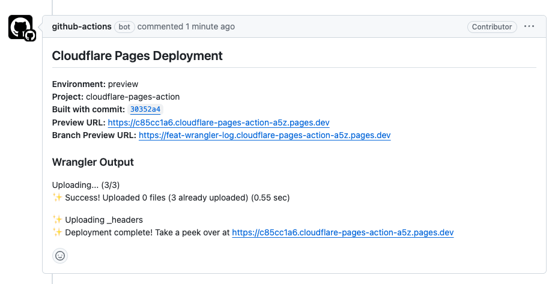

[](https://github.com/andykenward/github-actions-cloudflare-pages/actions/workflows/test.yml) [](https://github.com/andykenward/github-actions-cloudflare-pages/actions/workflows/check-dist.yml) [](https://github.com/andykenward/github-actions-cloudflare-pages/actions/workflows/release.yml) [](https://results.pre-commit.ci/latest/github/andykenward/github-actions-cloudflare-pages/main)

# GitHub Action — Cloudflare Pages

Deploy your build output to [Cloudflare Pages] with [Wrangler], while tracking every release through [GitHub Environments] and [GitHub Deployment]. On a [pull request], it creates a preview deployment and comments the URL on the PR.

**Features**

- Deploy to [Cloudflare Pages].
- Track releases with [GitHub Environments] & [GitHub Deployment].
- Comment the deployment URL on pull requests.
- Delete old deployments with the companion [`/delete`](./delete/README.md) action.
- Run Wrangler from a subfolder via the `working-directory` input — handy for monorepos where `functions` isn't in the repo root.

## Quick start

1. Create a [Cloudflare Pages] project and an API token that can edit it.
2. **Manually create your [GitHub Environments]** (for example `production` and `preview`) — the action can't create them for you. See [Setup](#setup).
3. Add the Cloudflare values as repository secrets/variables, then add a workflow like the one below (this mirrors the official template in [.github/workflow-templates/deploy.yml](.github/workflow-templates/deploy.yml)):

```yaml
name: Cloudflare Pages Deploy
on:
  push:
    branches: [main]
  pull_request:
    branches: [main]

# Deny all permissions by default; grant only what each job needs.
permissions: {}

jobs:
  deploy:
    runs-on: ubuntu-latest
    timeout-minutes: 5
    permissions:
      actions: read # Only required for a private repo.
      contents: read
      deployments: write
      pull-requests: write
    steps:
      - uses: actions/checkout@v4
      - name: Deploy to Cloudflare Pages
        uses: andykenward/github-actions-cloudflare-pages@1f45924c4dd0c6d746a7edfaa4e1dea8958806a6 #v3.4.0
        with:
          cloudflare-api-token: ${{ secrets.CLOUDFLARE_API_TOKEN }}
          cloudflare-account-id: ${{ vars.CLOUDFLARE_ACCOUNT_ID }}
          cloudflare-project-name: ${{ vars.CLOUDFLARE_PROJECT_NAME }}
          directory: dist
          github-token: ${{ secrets.GITHUB_TOKEN }}
          github-environment: ${{ (github.ref == 'refs/heads/main' && 'production') || 'preview' }}
```

The `github-environment` expression deploys the `main` branch to `production` and every other branch to `preview`.

## Setup

### 1. Cloudflare

Create a [Cloudflare Pages] project, then give the action three values (store the token as a repository **secret** and the rest as **variables** or secrets):

- `cloudflare-api-token` — an API token with permission to edit Cloudflare Pages.
- `cloudflare-account-id` — your Cloudflare account ID.
- `cloudflare-project-name` — the Pages project to upload to.

### 2. GitHub Environments (required)

> [!IMPORTANT]
> This action does **not** create [GitHub Environments]. Creating them requires the GitHub API `administration:write` permission, which the action can't request — so you must create them manually. See [Creating an environment].

Create each environment you reference (for example `production` and `preview`), then select one per run with the `github-environment` input. A common pattern switches on the branch:

```yaml
github-environment: ${{ (github.ref == 'refs/heads/main' && 'production') || 'preview' }}
```

### 3. Permissions

When using the workflow's built-in [`GITHUB_TOKEN`] for the `github-token` input, grant these [permissions]:

```yaml
permissions:
  actions: read # Only required for a private GitHub repo.
  contents: read
  deployments: write
  pull-requests: write
```

## Inputs

| Input                     | Required | Description                                                                                                                   |
| ------------------------- | -------- | ----------------------------------------------------------------------------------------------------------------------------- |
| `cloudflare-api-token`    | yes      | Cloudflare API Token                                                                                                          |
| `cloudflare-account-id`   | yes      | Cloudflare Account ID                                                                                                         |
| `cloudflare-project-name` | yes      | Cloudflare Pages project to upload to                                                                                         |
| `directory`               | yes      | Directory of static files to upload                                                                                           |
| `github-token`            | yes      | Github API key, make sure to add the required permissions for this action.                                                    |
| `github-environment`      | yes      | GitHub environment to deploy to. You need to manually create this for the github repo                                         |
| `pr-number`               | no       | GitHub pull request number to comment on. If not set, the action auto-detects from the event payload.                         |
| `working-directory`       | no       | Directory to run wrangler cli from                                                                                            |
| `wrangler-version`        | no       | Wrangler version to use. Otherwise a default version from the action will be used.                                            |
| `branch`                  | no       | Branch name to use for Cloudflare Pages deployment. If not set, the branch is automatically detected from the GitHub context. |

## Outputs

| Output        | Description                                                                           |
| ------------- | ------------------------------------------------------------------------------------- |
| `id`          | Cloudflare Pages deployed id                                                          |
| `url`         | Cloudflare Pages deployed url                                                         |
| `environment` | Cloudflare Pages deployed environment `production` or `preview`                       |
| `alias`       | Cloudflare Pages deployed alias. Falls back to deployed url if deployed alias is null |
| `wrangler`    | Wrangler cli output                                                                   |

## Examples

Ready-to-use GitHub Workflow Templates live in [.github/workflow-templates/](.github/workflow-templates/):

- [deploy.yml](.github/workflow-templates/deploy.yml)
- [delete.yml](.github/workflow-templates/delete.yml)

### Fork pull requests with `workflow_run`

Pull requests from forks don't have access to secrets in the initial `pull_request` workflow. Use a second workflow triggered by `workflow_run` to deploy from the original repository context after the first workflow succeeds, and set the `pr-number` input so the action can find the right pull request to comment on.

```yaml
name: Deploy PR Preview (Fork Safe)
on:
  workflow_run:
    workflows: ['CI']
    types: [completed]

jobs:
  deploy:
    if: ${{ github.event.workflow_run.conclusion == 'success' }}
    permissions:
      contents: read
      deployments: write
      pull-requests: write
    runs-on: ubuntu-latest
    steps:
      - uses: actions/checkout@v4
        with:
          repository: ${{ github.event.workflow_run.head_repository.full_name }}
          ref: ${{ github.event.workflow_run.head_sha }}

      - name: Deploy to Cloudflare Pages
        uses: andykenward/github-actions-cloudflare-pages@1f45924c4dd0c6d746a7edfaa4e1dea8958806a6 #v3.4.0
        with:
          cloudflare-api-token: ${{ secrets.CLOUDFLARE_API_TOKEN }}
          cloudflare-account-id: ${{ vars.CLOUDFLARE_ACCOUNT_ID }}
          cloudflare-project-name: ${{ vars.CLOUDFLARE_PROJECT_NAME }}
          directory: dist
          github-token: ${{ secrets.GITHUB_TOKEN }}
          github-environment: preview
          pr-number: # The PR number
```

The action supports the `workflow_run` event and uses its head commit SHA and branch for the deployment metadata.

### Custom branch name

You can override the automatically detected branch name using the `branch` input. This is useful when using `workflow_run` to deploy pull requests from forks to a preview deployment without overwriting the main/production deployment:

```yaml
- name: Deploy to Cloudflare Pages
  uses: andykenward/github-actions-cloudflare-pages@1f45924c4dd0c6d746a7edfaa4e1dea8958806a6 #v3.4.0
  with:
    cloudflare-api-token: ${{ secrets.CLOUDFLARE_API_TOKEN }}
    cloudflare-account-id: ${{ vars.CLOUDFLARE_ACCOUNT_ID }}
    cloudflare-project-name: ${{ vars.CLOUDFLARE_PROJECT_NAME }}
    directory: dist
    github-token: ${{ secrets.GITHUB_TOKEN }}
    github-environment: preview
    branch: pr-${{ github.event.workflow_run.pull_requests[0].number }}
    pr-number: ${{ github.event.workflow_run.pull_requests[0].number }}
```

This creates a Cloudflare Pages preview deployment with a branch name like `pr-123`, ensuring each pull request gets its own preview environment.

## Pull request comment



## Deleting deployments

Use the companion sub-action [`andykenward/github-actions-cloudflare-pages/delete`](./delete/README.md) to remove old deployments.

The GitHub Deployment payload this action creates includes the Cloudflare metadata the delete action needs:

```json
{
  "payload": {
    "cloudflare": {
      "id": "123",
      "projectName": "cloudflare-pages-project-name",
      "accountId": "123"
    },
    "url": "https://example.com",
    "commentId": "1234"
  }
}
```

## Debugging

GitHub provides two debug log levels — see [Action Debugging]. Enable them by [setting a repository secret]:

- **Step debug logs**: set `ACTIONS_STEP_DEBUG` to `true`. Debug events then appear in the [downloaded logs] and [web logs].
- **Runner diagnostic logs**: set `ACTIONS_RUNNER_DEBUG` to `true`. Extra diagnostic files then appear in the `runner-diagnostic-logs` folder of the [log archive][downloaded logs].

## Upgrading

Upgrading from an older version? Check [CHANGELOG.md](./CHANGELOG.md) for breaking changes.

## Related docs

- [GitHub Actions variables](https://docs.github.com/en/actions/learn-github-actions/variables) and [default environment variables](https://docs.github.com/en/actions/learn-github-actions/variables#default-environment-variables)
- [TypeScript ESM Node](https://www.typescriptlang.org/docs/handbook/esm-node.html)

[Cloudflare Pages]: https://pages.cloudflare.com/
[Wrangler]: https://developers.cloudflare.com/workers/wrangler/
[pull request]: https://docs.github.com/en/pull-requests
[GitHub Environments]: https://docs.github.com/en/actions/deployment/targeting-different-environments/using-environments-for-deployment
[GitHub Deployment]: https://docs.github.com/en/actions/deployment/targeting-different-environments/using-environments-for-deployment
[Creating an environment]: https://docs.github.com/en/actions/deployment/targeting-different-environments/using-environments-for-deployment#creating-an-environment
[permissions]: https://docs.github.com/en/actions/using-workflows/workflow-syntax-for-github-actions#permissions
[`GITHUB_TOKEN`]: https://docs.github.com/en/actions/security-guides/automatic-token-authentication
[Action Debugging]: https://github.com/actions/toolkit/blob/main/docs/action-debugging.md#step-debug-logs
[setting a repository secret]: https://help.github.com/en/actions/automating-your-workflow-with-github-actions/creating-and-using-encrypted-secrets#creating-encrypted-secrets
[downloaded logs]: https://help.github.com/en/actions/automating-your-workflow-with-github-actions/managing-a-workflow-run#downloading-logs
[web logs]: https://help.github.com/en/actions/automating-your-workflow-with-github-actions/managing-a-workflow-run#viewing-logs-to-diagnose-failures
