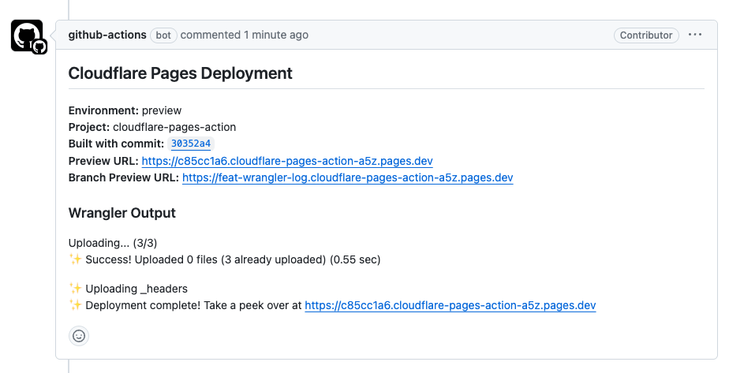

[](https://github.com/andykenward/github-actions-cloudflare-pages/actions/workflows/test.yml) [](https://github.com/andykenward/github-actions-cloudflare-pages/actions/workflows/check-dist.yml) [](https://github.com/andykenward/github-actions-cloudflare-pages/actions/workflows/release.yml) [](https://github.com/andykenward/github-actions-cloudflare-pages/actions/workflows/prek.yml)

# GitHub Action — Cloudflare Pages

Deploy your build output to [Cloudflare Pages] with [Wrangler], while tracking every release through [GitHub Environments] and [GitHub Deployment]. On a [pull request], it creates a preview deployment and comments the URL on the PR.

**Features**

- Deploy to [Cloudflare Pages] and wait for the deployment to finish — the step fails if the build fails or isn't live within 10 minutes.
- Track releases with [GitHub Environments] & [GitHub Deployment].
- Comment the deployment URL on pull requests.
- Write a [job summary] of each deployment.
- Delete old deployments with the companion [`/delete`](./delete/README.md) action.
- Run Wrangler from a subfolder via the `working-directory` input — handy for monorepos where `functions` isn't in the repo root.

## Quick start

1. Create a [Cloudflare Pages] project and an API token that can edit it.
2. **Manually create your [GitHub Environments]** (for example `production` and `preview`) — the action can't create them for you. See [Setup](#setup).
3. Add the Cloudflare values as repository secrets/variables, then add a workflow like the one below (this mirrors the official template in [.github/workflow-templates/deploy.yml](.github/workflow-templates/deploy.yml)):

```yaml
name: Cloudflare Pages Deploy
on:
  push:
    branches: [main]
  pull_request:
    branches: [main]

# Deny all permissions by default; grant only what each job needs.
permissions: {}

jobs:
  deploy:
    runs-on: ubuntu-latest
    timeout-minutes: 15 # The action waits up to 10 minutes for Cloudflare.
    permissions:
      actions: read # Only required for a private repo.
      contents: read
      deployments: write
      pull-requests: write
    steps:
      - uses: actions/checkout@v4
      - name: Deploy to Cloudflare Pages
        uses: andykenward/github-actions-cloudflare-pages@46d86e1caa6b86365a41d335db65a6936a1beb39 #v3.5.0
        with:
          cloudflare-api-token: ${{ secrets.CLOUDFLARE_API_TOKEN }}
          cloudflare-account-id: ${{ vars.CLOUDFLARE_ACCOUNT_ID }}
          cloudflare-project-name: ${{ vars.CLOUDFLARE_PROJECT_NAME }}
          directory: dist
          github-token: ${{ secrets.GITHUB_TOKEN }}
          github-environment: ${{ (github.ref == 'refs/heads/main' && 'production') || 'preview' }}
```

The `github-environment` expression deploys the `main` branch to `production` and every other branch to `preview`. For a line-by-line breakdown of this expression — and how it relates to the Cloudflare `branch` input — see [GitHub Environments](#2-github-environments-required).

## Setup

### 1. Cloudflare

Create a [Cloudflare Pages] project, then give the action three values (store the token as a repository **secret** and the rest as **variables** or secrets):

- `cloudflare-api-token` — an API token with permission to edit Cloudflare Pages.
- `cloudflare-account-id` — your Cloudflare account ID.
- `cloudflare-project-name` — the Pages project to upload to.

With the [GitHub CLI], run these from your repository — the token is read from a prompt, so it stays out of your shell history:

```sh
gh secret set CLOUDFLARE_API_TOKEN
gh variable set CLOUDFLARE_ACCOUNT_ID --body "<account-id>"
gh variable set CLOUDFLARE_PROJECT_NAME --body "<project-name>"
```

No Pages project yet? Create one with `npx wrangler pages project create <project-name> --production-branch main`.

### 2. GitHub Environments (required)

> [!IMPORTANT]
> This action does **not** create [GitHub Environments]. Creating them requires the GitHub API `administration:write` permission, which the action can't request — so you must create them manually. See [Creating an environment].

To create them with the [GitHub CLI] — this needs admin access to the repository, which your own `gh auth login` session usually has and the workflow's `GITHUB_TOKEN` never does:

```sh
gh api --method PUT "repos/{owner}/{repo}/environments/production"
gh api --method PUT "repos/{owner}/{repo}/environments/preview"
```

Create each environment you reference (for example `production` and `preview`), then select one per run with the `github-environment` input. A common pattern switches on the branch:

```yaml
github-environment: ${{ (github.ref == 'refs/heads/main' && 'production') || 'preview' }}
```

GitHub Actions has no `condition ? a : b` ternary, so this uses the `&&`/`||` idiom to get the same result. Read it as **"if on `main`, use `production`, otherwise use `preview`"**:

- `github.ref` is the full ref of the branch that triggered the run, e.g. `refs/heads/main` or `refs/heads/my-feature`.
- `github.ref == 'refs/heads/main'` is `true` only on the `main` branch.
- `A && B` returns `B` when `A` is true, so on `main` the expression so far is `'production'`; on any other branch it is `false`.
- `X || 'preview'` returns `X` unless `X` is falsy, so a `false` left side falls through to `'preview'`.

To map more branches to environments, extend the same pattern — for example, send `main` to `production`, `staging` to `staging`, and everything else to `preview`:

```yaml
github-environment: >-
  ${{ (github.ref == 'refs/heads/main' && 'production')
   || (github.ref == 'refs/heads/staging' && 'staging')
   || 'preview' }}
```

> [!NOTE]
> `github-environment` only sets the **GitHub** Environment the deployment is recorded against. Whether Cloudflare treats the upload as a production or preview deployment is decided separately, by the **branch name** — Cloudflare promotes the deployment to production only when the branch matches your Pages project's production branch. By default the branch is detected from the GitHub context; use the [`branch`](#custom-branch-name) input to override it. The two inputs are independent, so make sure your branch logic and `github-environment` logic agree on what counts as "production".

### 3. Permissions

When using the workflow's built-in [`GITHUB_TOKEN`] for the `github-token` input, grant these [permissions]:

```yaml
permissions:
  actions: read # Only required for a private GitHub repo.
  contents: read
  deployments: write
  pull-requests: write
```

## Setting up with an AI agent

Adding this action with an AI coding agent? Install its skill, which walks the agent through the steps below:

```sh
npx skills add andykenward/github-actions-cloudflare-pages
```

Or point the agent at this section.

1. **Do the steps outside the workflow file first** — they can't be expressed in YAML. Run them, or ask the user to:
   - create a Cloudflare Pages project and an API token with the **Cloudflare Pages: Edit** permission;
   - add the `CLOUDFLARE_API_TOKEN` secret and the `CLOUDFLARE_ACCOUNT_ID` / `CLOUDFLARE_PROJECT_NAME` variables;
   - create every GitHub Environment the workflow names in `github-environment`.

   The commands are in [Setup](#setup).

2. **Pick the workflow** for how the project receives changes:

   | Situation                                                                | Start from                                                                                                                    |
   | ------------------------------------------------------------------------ | ----------------------------------------------------------------------------------------------------------------------------- |
   | Pushes to `main`, and pull requests from branches in the same repository | [Quick start](#quick-start)                                                                                                   |
   | Pull requests from forks                                                 | [Fork pull requests with `workflow_run`](#fork-pull-requests-with-workflow_run) and [Custom branch name](#custom-branch-name) |
   | Removing preview deployments when a pull request closes                  | The [delete action](./delete/README.md#quick-start)                                                                           |

3. **Fit it to the project:**
   - Add the project's build step before the deploy step, and set `directory` to its output (relative to `working-directory`).
   - Keep `uses:` pinned to the full commit SHA shown in these examples.
   - Use only environment names that exist.
   - Never build `pr-number` or `branch` from `github.event.workflow_run.pull_requests[0]` — it's empty for pull requests from forks.

4. **Check the first run:** the step's `url` output, the job summary, the pull request comment, and a new deployment under the repository's Environments.

## How it works

1. **Checks while uploading.** While Wrangler uploads `directory`, the action checks that `github-environment` exists and finds the pull request to comment on. If either fails, the upload is stopped and the step fails straight away, so no orphaned Cloudflare deployment is left behind.
2. **Waits for Cloudflare.** It polls the deployment Wrangler just created every second, for up to 10 minutes, until it's live. A build still running after 10 minutes fails the step. So does a failed or canceled build, once the outputs and job summary are written: the error links to the Cloudflare build log, and no pull request comment or GitHub Deployment is created.
3. **Reports.** It sets the [outputs](#outputs) and writes a [job summary] with the environment, branch, commit, status, URLs and Wrangler output.
4. **Comments** on the pull request, if there is one — see [below](#which-pull-request-gets-the-comment).
5. **Records a [GitHub Deployment]** in `github-environment`, with a success status that links to the deployment URL and its Cloudflare build log.

### Supported events

`push`, `pull_request`, `workflow_dispatch` and `workflow_run`. Any other event fails the step.

### Which pull request gets the comment

| Trigger                           | Pull request commented on                                                                                                                                                                                                                                     |
| --------------------------------- | ------------------------------------------------------------------------------------------------------------------------------------------------------------------------------------------------------------------------------------------------------------- |
| `pr-number` input set (any event) | That pull request. The step fails if the value isn't a valid pull request number.                                                                                                                                                                             |
| `pull_request`                    | The event's pull request. No comment when the pull request is `closed`.                                                                                                                                                                                       |
| `workflow_dispatch`               | The first open pull request whose head is the run's branch. The step fails if there is none.                                                                                                                                                                  |
| `workflow_run`                    | The one pull request in the event's `pull_requests` that matches its head branch and commit. The step fails if there are none or several. For pull requests from forks the list is always empty, so [set `pr-number`](#fork-pull-requests-with-workflow_run). |
| `push`                            | None.                                                                                                                                                                                                                                                         |

## Inputs

| Input                     | Required | Description                                                                                                                                                                                  |
| ------------------------- | -------- | -------------------------------------------------------------------------------------------------------------------------------------------------------------------------------------------- |
| `cloudflare-api-token`    | yes      | Cloudflare API token with permission to edit Cloudflare Pages. It's passed only to the Wrangler process and masked in logs, even when it doesn't come from `secrets`.                        |
| `cloudflare-account-id`   | yes      | Cloudflare account ID.                                                                                                                                                                       |
| `cloudflare-project-name` | yes      | Cloudflare Pages project to upload to.                                                                                                                                                       |
| `directory`               | yes      | Directory of built static files to upload, relative to `working-directory`.                                                                                                                  |
| `github-token`            | yes      | GitHub token with the [required permissions](#3-permissions). Masked in logs, even when it doesn't come from `secrets`.                                                                      |
| `github-environment`      | yes      | [GitHub Environment](#2-github-environments-required) to record the deployment in. It must already exist.                                                                                    |
| `pr-number`               | no       | Pull request number to comment on. If not set, it's detected from the event — see [Which pull request gets the comment](#which-pull-request-gets-the-comment).                               |
| `working-directory`       | no       | Directory to run Wrangler from — e.g. where your `functions/` folder lives. Defaults to `.`, the job's working directory.                                                                    |
| `wrangler-version`        | no       | Wrangler version to run. Defaults to the version this release of the action pins. Versions too old to report the new deployment's id fall back to the most recent deployment for the commit. |
| `branch`                  | no       | Branch name for the Cloudflare Pages deployment. If not set, it's detected from the GitHub context.                                                                                          |

## Outputs

| Output        | Description                                                                           |
| ------------- | ------------------------------------------------------------------------------------- |
| `id`          | Cloudflare Pages deployed id                                                          |
| `url`         | Cloudflare Pages deployed url                                                         |
| `environment` | Cloudflare Pages deployed environment `production` or `preview`                       |
| `alias`       | Cloudflare Pages deployed alias. Falls back to deployed url if deployed alias is null |
| `wrangler`    | Wrangler cli output                                                                   |

## Examples

Ready-to-use GitHub Workflow Templates live in [.github/workflow-templates/](.github/workflow-templates/):

- [deploy.yml](.github/workflow-templates/deploy.yml)
- [delete.yml](.github/workflow-templates/delete.yml)

### Fork pull requests with `workflow_run`

Pull requests from forks don't have access to secrets in the initial `pull_request` workflow. Use a second workflow triggered by `workflow_run` to deploy from the original repository context after the first workflow succeeds, and set the `pr-number` input. For pull requests from forks, `workflow_run` lists no pull requests, so without `pr-number` the action can't find the pull request and the step fails.

```yaml
name: Deploy PR Preview (Fork Safe)
on:
  workflow_run:
    workflows: ['CI']
    types: [completed]

jobs:
  deploy:
    if: ${{ github.event.workflow_run.conclusion == 'success' }}
    permissions:
      contents: read
      deployments: write
      pull-requests: write
    runs-on: ubuntu-latest
    steps:
      - uses: actions/checkout@v4
        with:
          repository: ${{ github.event.workflow_run.head_repository.full_name }}
          ref: ${{ github.event.workflow_run.head_sha }}

      - name: Deploy to Cloudflare Pages
        uses: andykenward/github-actions-cloudflare-pages@46d86e1caa6b86365a41d335db65a6936a1beb39 #v3.5.0
        with:
          cloudflare-api-token: ${{ secrets.CLOUDFLARE_API_TOKEN }}
          cloudflare-account-id: ${{ vars.CLOUDFLARE_ACCOUNT_ID }}
          cloudflare-project-name: ${{ vars.CLOUDFLARE_PROJECT_NAME }}
          directory: dist
          github-token: ${{ secrets.GITHUB_TOKEN }}
          github-environment: preview
          pr-number: # The PR number
```

The action supports the `workflow_run` event and uses its head commit SHA and branch for the deployment metadata.

### Custom branch name

You can override the automatically detected branch name with the `branch` input. This is useful with `workflow_run`: a fork pull request opened from the fork's `main` branch would otherwise deploy to your project's production branch and overwrite the production deployment. Giving each pull request its own branch name (for example `pr-123`) keeps it on a separate Cloudflare Pages preview.

**Do not** build the branch name from `github.event.workflow_run.pull_requests[0].number` — that array is empty for pull requests from forks ([community discussion #25220](https://github.com/orgs/community/discussions/25220)), which is the exact case this is meant to cover. Instead, save the PR number in the triggering `pull_request` workflow and read it back from an artifact in the `workflow_run` workflow.

In the `pull_request` workflow (the one named in `workflows:` of the `workflow_run` trigger), save the PR number alongside your build output:

```yaml
- name: Save PR number
  run: echo "${{ github.event.number }}" > pr-number.txt

- name: Upload PR number
  uses: actions/upload-artifact@v4
  with:
    name: pr-number
    path: pr-number.txt
```

Then, in the `workflow_run` workflow, download it and pass it to both `branch` and `pr-number`:

```yaml
jobs:
  deploy:
    if: ${{ github.event.workflow_run.conclusion == 'success' }}
    permissions:
      actions: read
      contents: read
      deployments: write
      pull-requests: write
    runs-on: ubuntu-latest
    steps:
      - name: Download PR number
        uses: actions/download-artifact@v4
        with:
          name: pr-number
          run-id: ${{ github.event.workflow_run.id }}
          github-token: ${{ secrets.GITHUB_TOKEN }}

      - name: Read PR number
        id: pr
        run: echo "number=$(cat pr-number.txt)" >> "$GITHUB_OUTPUT"

      - name: Deploy to Cloudflare Pages
        uses: andykenward/github-actions-cloudflare-pages@46d86e1caa6b86365a41d335db65a6936a1beb39 #v3.5.0
        with:
          cloudflare-api-token: ${{ secrets.CLOUDFLARE_API_TOKEN }}
          cloudflare-account-id: ${{ vars.CLOUDFLARE_ACCOUNT_ID }}
          cloudflare-project-name: ${{ vars.CLOUDFLARE_PROJECT_NAME }}
          directory: dist
          github-token: ${{ secrets.GITHUB_TOKEN }}
          github-environment: preview
          branch: pr-${{ steps.pr.outputs.number }}
          pr-number: ${{ steps.pr.outputs.number }}
```

This creates a Cloudflare Pages preview deployment with a branch name like `pr-123`, so each pull request — including those from forks — gets its own preview environment instead of overwriting production.

## Pull request comment



## Deleting deployments

Use the companion sub-action [`andykenward/github-actions-cloudflare-pages/delete`](./delete/README.md) to remove old deployments.

The GitHub Deployment payload this action creates includes the Cloudflare metadata the delete action needs:

```json
{
  "payload": {
    "cloudflare": {
      "id": "123",
      "projectName": "cloudflare-pages-project-name",
      "accountId": "123"
    },
    "url": "https://example.com",
    "commentId": "1234"
  }
}
```

## Troubleshooting

A failed step's annotation carries a one-line message; turn on [step debug logs](#debugging) for the full error.

| Message                                                                                      | Cause and fix                                                                                                                                                                               |
| -------------------------------------------------------------------------------------------- | ------------------------------------------------------------------------------------------------------------------------------------------------------------------------------------------- |
| `Input required and not supplied: <input>`                                                   | A required input is empty. Check the secret or variable exists — on a fork's `pull_request` run, secrets are empty, so deploy with [`workflow_run`](#fork-pull-requests-with-workflow_run). |
| `Input '<input>' is invalid: …`                                                              | The input has the wrong format; the rest of the message says what was expected.                                                                                                             |
| `GitHub Action event name '<name>' not supported.`                                           | Trigger on one of the [supported events](#supported-events).                                                                                                                                |
| `GitHub Environment: Not created for <name>`                                                 | The environment doesn't exist — [create it](#2-github-environments-required), or fix the `github-environment` expression.                                                                   |
| `GitHub Environment: No ref id <name>`                                                       | The branch or tag the run is for no longer exists, e.g. it was deleted before the run started.                                                                                              |
| `GitHub Environment: Errors - […]`                                                           | GitHub rejected the lookup; the JSON lists its errors. Usually `github-token` is missing a [permission](#3-permissions).                                                                    |
| `GitHub API request failed: <status> …`                                                      | A 401 or 403 means `github-token` is invalid or missing a [permission](#3-permissions).                                                                                                     |
| A JSON list of errors mentioning `Resource not accessible by integration`                    | `github-token` is missing a [permission](#3-permissions) — usually `deployments: write` or `pull-requests: write`.                                                                          |
| `Invalid pr-number input: <value>`                                                           | `pr-number` must be a positive whole number.                                                                                                                                                |
| `No pull request node id found for pr-number input: <number>`                                | No pull request with that number exists in this repository.                                                                                                                                 |
| `No pull request node id found for workflow_dispatch event`                                  | No open pull request is headed by the dispatched branch. Dispatch from one, or set `pr-number`.                                                                                             |
| `No pull request found in workflow_run event matching head branch and sha`                   | The run has no matching pull request — always the case for forks. Set `pr-number` ([example](#custom-branch-name)).                                                                         |
| `Multiple pull requests found in workflow_run event matching head branch and sha`            | Several pull requests share the commit. Set `pr-number`.                                                                                                                                    |
| `Status Of Deployment: timed out after 10m waiting for the deploy stage to complete.`        | Cloudflare didn't finish within 10 minutes. Check the build in the Cloudflare dashboard.                                                                                                    |
| An error printed by Wrangler                                                                 | The upload failed and Wrangler's message says why. Check the token's permission, `cloudflare-account-id`, `cloudflare-project-name` and `directory`.                                        |
| The job is cancelled at its time limit                                                       | Raise the job's `timeout-minutes` to at least 15 — the action waits up to 10 minutes for Cloudflare.                                                                                        |
| `Create Deployment: the Cloudflare Pages build failed. Build log: <url>` (or `was canceled`) | The build failed or was canceled on Cloudflare. Open the build log link; the outputs and job summary still describe the deployment.                                                         |

## Debugging

GitHub provides two debug log levels — see [Action Debugging]. Enable them by [setting a repository secret]:

- **Step debug logs**: set `ACTIONS_STEP_DEBUG` to `true`. Debug events then appear in the [downloaded logs] and [web logs]. When a step fails, its annotation carries a one-line message; the full error (stack trace and nested causes) is only logged at this level.
- **Runner diagnostic logs**: set `ACTIONS_RUNNER_DEBUG` to `true`. Extra diagnostic files then appear in the `runner-diagnostic-logs` folder of the [log archive][downloaded logs].

## Contributing

See [CONTRIBUTING.md](CONTRIBUTING.md) for setting up the repository, running the checks and opening a pull request.

## Upgrading

Upgrading from an older version? Check [CHANGELOG.md](./CHANGELOG.md) for breaking changes.

## Related docs

- [GitHub Actions variables](https://docs.github.com/en/actions/learn-github-actions/variables) and [default environment variables](https://docs.github.com/en/actions/learn-github-actions/variables#default-environment-variables)

[Cloudflare Pages]: https://pages.cloudflare.com/
[GitHub CLI]: https://cli.github.com/
[job summary]: https://docs.github.com/en/actions/using-workflows/workflow-commands-for-github-actions#adding-a-job-summary
[Wrangler]: https://developers.cloudflare.com/workers/wrangler/
[pull request]: https://docs.github.com/en/pull-requests
[GitHub Environments]: https://docs.github.com/en/actions/deployment/targeting-different-environments/using-environments-for-deployment
[GitHub Deployment]: https://docs.github.com/en/actions/deployment/targeting-different-environments/using-environments-for-deployment
[Creating an environment]: https://docs.github.com/en/actions/deployment/targeting-different-environments/using-environments-for-deployment#creating-an-environment
[permissions]: https://docs.github.com/en/actions/using-workflows/workflow-syntax-for-github-actions#permissions
[`GITHUB_TOKEN`]: https://docs.github.com/en/actions/security-guides/automatic-token-authentication
[Action Debugging]: https://github.com/actions/toolkit/blob/main/docs/action-debugging.md#step-debug-logs
[setting a repository secret]: https://help.github.com/en/actions/automating-your-workflow-with-github-actions/creating-and-using-encrypted-secrets#creating-encrypted-secrets
[downloaded logs]: https://help.github.com/en/actions/automating-your-workflow-with-github-actions/managing-a-workflow-run#downloading-logs
[web logs]: https://help.github.com/en/actions/automating-your-workflow-with-github-actions/managing-a-workflow-run#viewing-logs-to-diagnose-failures
